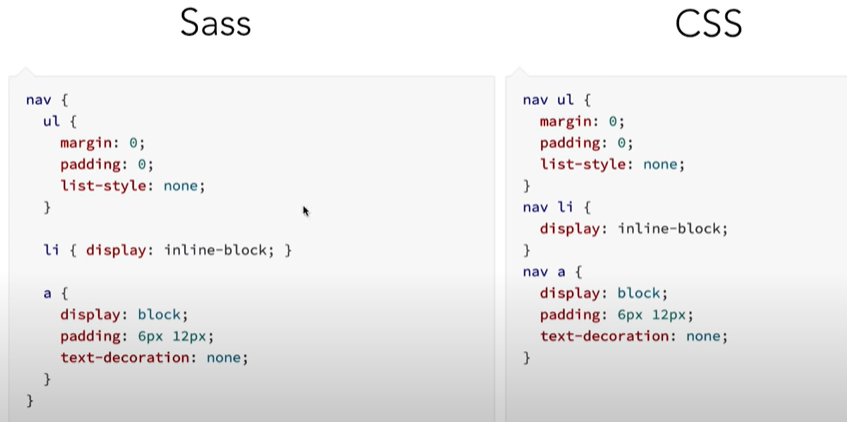
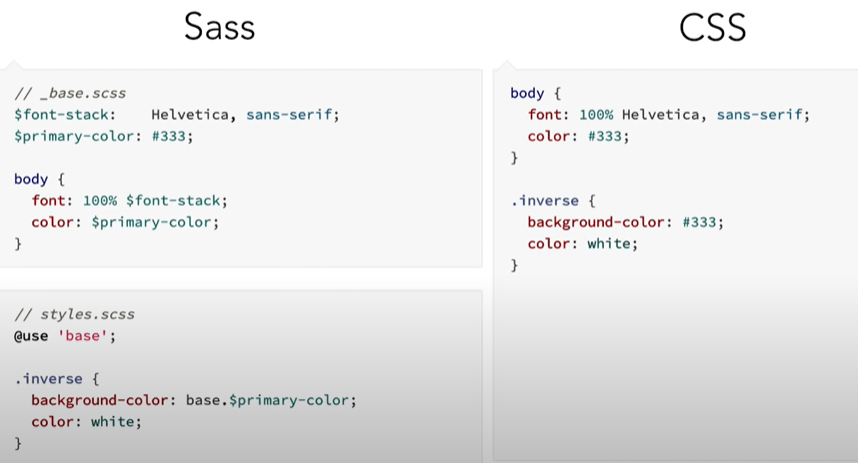
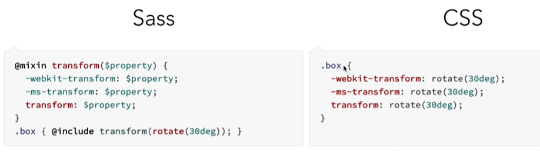
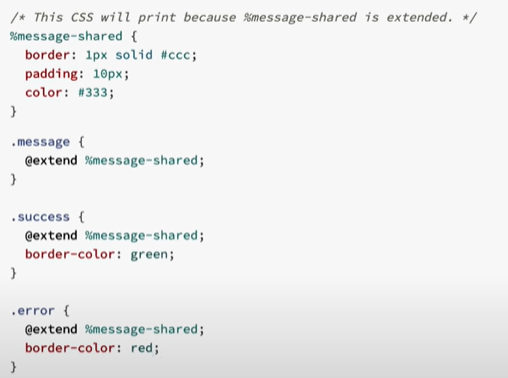
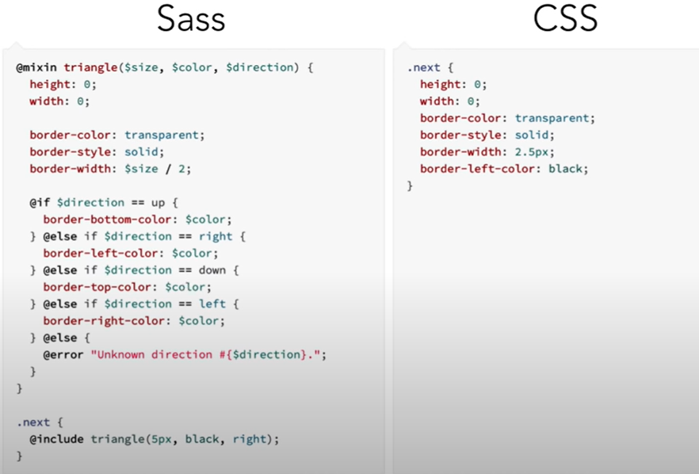

# Sass crash course
 - Syntactically Awsome StyleSheet
 - CSS preprocessor
 - sass files will be compiled to css

## Sass vs Scss
 - Sass use indentation, Scss use curly brackets.
 - But both will be compiled into same css.

### Variables
- use '$' initialize var. ($color: #333)
- reusable.

### Nesting
- Reduce code repeating.
- 

### Models or Partials
- these are Sass or Scss files that have an underscore in the front of the filename.
- underscore will make this file compile only when the file is imported.
- 

### Mixins & Functions
- Mixins will provide setof css rules, which are reuseable.
    - use '@mixin' to create.
    - use '@include' to call.
- Function will performe calculations, that will return something.
- 

### Inheritance (Extende)
- copy the same style & apply to an element.
- write '@extend' and name of the styling.
- 

### Conditionals
- use '@if', '@else if', 'else'.
- 
